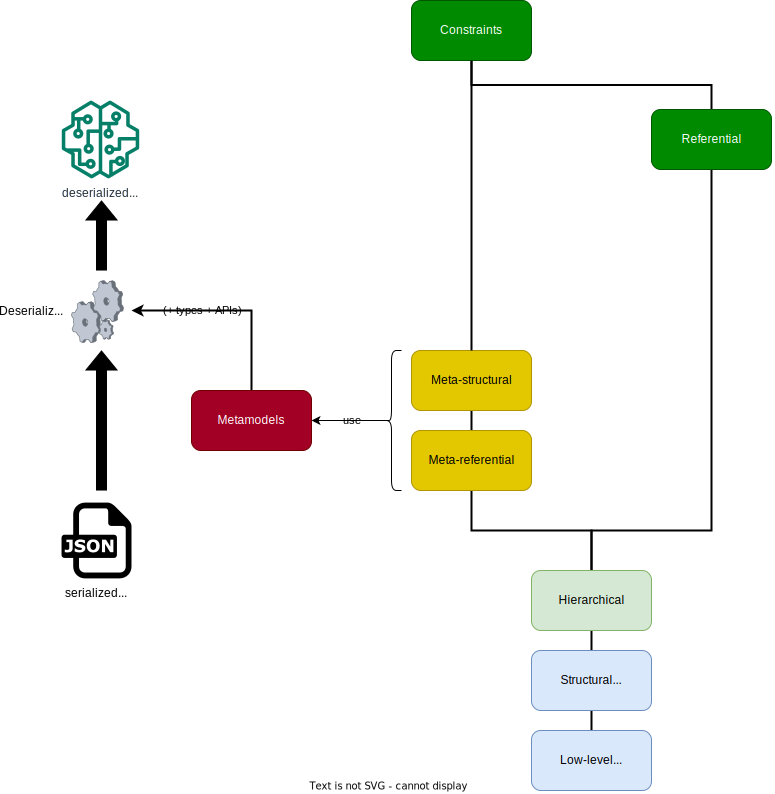

= Model correctness

We can identify a number of levels of correctness of a model.
Each level builds on the previous one, so achieving a certain level of correctness implies having achieved all previous levels.
The levels are divided into two layers.

.Model correctness explained in a diagram

== Correctness of the JSON serialization of a model

A JSON serialization of a model is considered to be deserializable (precisely) if it's correct with respect to all these levels.

[horizontal]
Low-level syntactic:: The serialization is parsable as JSON.
Note that “parsable” doesn't necessarily mean “syntax-correct”.
E.g., trailing commas are not syntax-correct, but don't necessarily prevent the JSON from being parsable, nor deserializable.

Structural syntactic:: The JSON conforms to link:../schemas/serialization.schema.json[the JSON Schema for the serialization format]footnote:[This file should match link:https://github.com/LIonWeb-org/lioncore-typescript/blob/main/schemas/generic-serialization.schema.json[the one in the `lioncore-typescript` repository].].
The `serializationFormatVersion` property of the root object of the serialization indicates which version to use (or should do so).
Currently, there's only one version, which is identified as: `"1"` (i.e., a string containing the integer 1).
+
Note that JSON Schema isn't powerful enough to express more high-level, nor referential constraints on the model serialized as JSON.
In particular, it's not possible to specify constraints such as that an ID points to an object having that ID.
An example of such a constraint is the `parent` property of a serialized node.

Hierarchical:: The JSON doesn't violate the following constraints.
+
* Node IDs are unique (within the serialization).
* No double serializations (even if the serializations are identical).
* The `parent` property of a serialized node matches the `id` of the containing node (whenever that containing node is present in the serialization).
Concretely: if a node `N` is a child of a node `P` then `N.parent` should equal `P`.
* No double containments, i.e. nodes are not the children of multiple other nodes, nor of themselves.
+
At this points, links (so: containments and references) don't have to resolve.
Concretely, this means that IDs that are values of pairs in `children` and `containments` don't need to resolve to a serialized node in the same JSON serialization.
(They could in another serialization.)

Meta-referential:: The metamodels specified in the serialization are known and _available_ in the sense that the client('s deserializer) knows how to deserialize models conforming to them.
That would typically imply the presence of type definitions.

Meta-structural:: The seralization matches the metamodels - in particular:
+
* Concept IDs are (uniquely) resolvable.
* Every key in the `properties`, `children`, or `references` sub objects of the object corresponding to a serialized node is the ID of a feature of the concept pointed to by the `concept` ID value.
* No additional key-value pairs are present in those sub objects.
* A key in the `properties` sub object corresponds to ID of a `Property` feature, etc.
* For each key-value pair in the `properties` sub object: the value has a type matching the `type` specified by the `Property` feature corresponding to the key.
+
Because the model hasn't been deserialized at this point, incorrectness can't be reported yet as a model with references to nodes.
Instead, we need another means of referencing a specific location in the serialization, such as an XPath and/or a line/column identification.

== Correctness of the deserialized model

[horizontal]
Referential:: All references resolve.
Constraints:: No constraint violations.

Incorrectness can be reported as a model with references to nodes.
For multi-valued features, an index has to be included as well.

