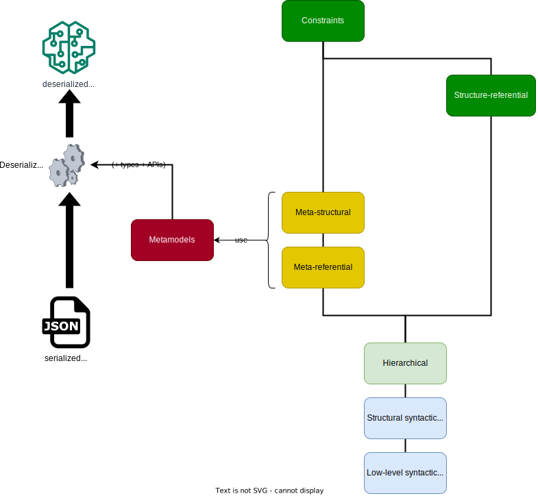

= Model correctness

We can identify a number of separate criteria for the correctness of a model.
Failure to comply to one or more of these criteria doesn't imply incorrectness of the model.
Typically, it's quite possible to recover from such failures.
The criteria can be visualized as follows.

.The criteria for model correctness as a diagram
image::../resources/correctness-diagrams/criteria.svg[align="center"]

The discussion of these criteria below is divided into two layers:

. JSON serialization of the model: the _serialization chunk_
. The model (post-deserialization/in-memory)

Each criterion has three aspects:

. What are the conditions to comply to?
. How is an incorrectness to be reported?
. Can an incorrectness be recovered from (and if so: how)?

== Serialization chunk

=== Low-level syntactic

The serialization is parsable as JSON.
Note that “parsable” doesn't necessarily mean “syntax-correct”.
E.g., trailing commas are not syntax-correct, but don't necessarily prevent the JSON from being parsable, nor deserializable.
It's desirable to be able to recover from "`simple`"/"`obvious`" syntax errors in the JSON.

Incorrectness is to be reported in terms of the location where parsing the JSON text failed, including an indication whether this was recoverable.
The reporting is typically dependent on the precise JSON parser used.

=== Structural syntactic

The JSON conforms to link:../schemas/serialization.schema.json[the JSON Schema for the serialization format]footnote:[This file should match link:https://github.com/LIonWeb-org/lioncore-typescript/blob/main/schemas/generic-serialization.schema.json[the one in the `lioncore-typescript` repository].].
The `serializationFormatVersion` property of the root object of the serialization indicates which version to use (or should do so).
Currently, there's only one version, which is identified as: `"1"` (i.e., a string containing the integer 1).

Note that JSON Schema isn't powerful enough to express more high-level, nor constraints of a referential nature on the serialization chunk.

Incorrectness is to be reported in terms of e.g. a https://github.com/json-path/JsonPath[JsonPath] to the location(s) of failure(s).
This is typically dependent on the precise JSON Schema validator framework/library/utility used.
Recovering from an incorrectness is sometimes possible, e.g.:

. If extra properties are present, they can simply be removed or ignored.
. If properties are missing, they could just be added, provided they have a compliant default value

=== Hierarchical

The JSON doesn't violate the following constraints.

. IDs of serialized nodes are unique (within the serialization).
Violation is to be reported in terms of precise locations in the JSON file of all the serialized nodes with equal ID.
. The `parent` property of a serialized node matches the `id` of the containing node (whenever that containing node is present in the serialization chunk).
Concretely: if a node `N` is a child of a node `P` then `N.parent` should equal `P`.
Violation is to be reported in terms of the ID of the contain**ing** serialized node, the ID of the contain**ed** serialized node, and the `parent` ID stated by that.
. No duplicate containments, i.e. nodes are not the children of multiple other nodes, nor of themselves.
Violation is to be reported in terms of the ID of the duplicately-contained serialized node, and the IDs of all serialized nodes that claim to contain it, including the links by which this happens, as well the index in the value of those links.
. **TODO**  extend for annotations

At this point, links (so: containments and references) don't need to resolve (yet).
Concretely, this means that IDs that are members of the `children` (for containments) or `targets` (for references) arrays, don't need to resolve to a node in the same JSON serialization.
They could -- or even: should -- reside in another serialization.
That pertains specifically to references to language entities of the LIonCore builtins language, which is assumed to be imported/available implicitly.
If all links do resolve, we say the serialization chunk is _self-contained_.

=== Meta-referential

All the metamodels specified in the serialization chunk are _made available_ to the client('s deserializer) in a suitable form.
That would typically imply the presence of types or type definitions in some programming language.
**Note** that this is a condition that pertains to the deserializing client, rather than on the serialization chunk.
Incorrectness could be partially recovered from by partially deserializing into "`dynamic`"/"`reflective`" nodes.

=== Meta-structural

The seralization matches the metamodels - in particular:

* Concept identifiers (tuples with a `key` value) are uniquely resolvable to a concept in a metamodel.
Incorrectness is to be reported in terms of the ID of the serialized and the key of the concept which can not be resolved.
* For every object corresponding to a serialized node:
** For every entry of the `properties`, `children`, or `references` arrays, the `key` in the `property`, `containment`, resp. `reference` sub object is the key of a feature of the concept pointed to by the `concept` identifier.
Incorrectness is to be reported in terms of the ID of the serialized node, the feature type (property/containment/reference), the index of the offending entry, and the key which can not be resolved.
** For every entry of a `properties` array, the value of the `value` property conforms to the `type` specified by the `Property` feature corresponding to the key.

Incorrectness is to be reported in terms of the ID of the serialized node, the feature type (property/containment/reference), the index of the offending entry, and the key which can not be resolved.
"`To resolve a key`" means that we can find a concept or feature in some metamodel with that key, and with (exactly-)matching version.
Incorrectness is to be reported as a model with references to nodes, as well as an appropriate error message.
Incorrectness could be partially recovered from by partially deserializing into "`dynamic`"/"`reflective`" nodes, leaving the unresolvable meta-references as-is.

== Model (post-deserialization/in-memory)

=== Structure-referential

All links (on M1/instance-level) resolve.
Note that this doesn't require any knowledge of the metamodels, as it just involves nodes' IDs.
This means that the serialization chunk doesn't need to be correct in the meta-referential nor in the meta-structural sense!
It should be alway possible to deserialize the serialization chunk into "`dynamic`"/"`reflective`" nodes, which could be useful in its own right.

// TODO  describe when and how links should be resolved, etc.

=== Constraints

No constraint violations.
Constraints can only be checked with full knowledge of all metamodels involved, so meta-referential, meta-structural correctness is necessary for this.
Also: the more "`interesting`" constraints typically navigate across references, so structure-referential correctness would also be necessary.
It should be possible to come up with some kind of "`partial constraint checking`" that deals with unresolved references in a meaningful way -- possibly reporting warnings, rather than outright constraint violations.
// TODO  come up with a "partial evaluation"-style semantics for navigating over an unresolved link, and e.g. type computation

Incorrectness is to be reported as a model with references to nodes, as well as an appropriate error message.
For multi-valued features, an index has to be included as well.
Recovery is more-or-less irrelevant from a technical standpoint, but incorrectness might obstruct/impede code generation, interpretation, type computation, etc.

// TODO  example of how to report violations of all stated kinds

**TODO**  improve following diagram:

