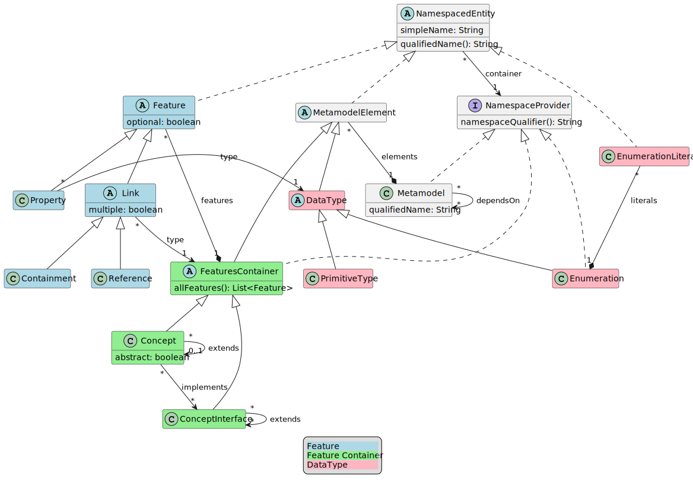

= Meta-Metamodel

In this document we describe the Meta-Metamodel to be used by LionWeb.
The Meta-Metamodel is called LionCore.

== Goals

The goal is to define a meta-metamodel that can be used in different contexts and implemented from different languages.

The approach taken would be conservative: we want to provide boring and proven infrastructure, so that innovation can be built on top of it.

This will be based on the experience that we as a community had with the Meta-Metamodel used in EMF and MPS mainly.
Suggestions based on the experience obtained with other Meta-Metamodels are also very welcome.

== Languages supported

We aim to have the initial implementations being available in Java and Typescript.
We are interested in implementing it in other languages too, but not as part of the initial effort.

== What kind of models should be expressible?

Any kind of model.
In other words, models specified using metamodels expressed through this Meta-Metamodel should not make any assumptions on the node being obtained from parsing text or a graphical modeling tool or a projectional editor.
All these possible origins should be supported, with specific extensions were necessary.

For example, metamodels should be expressed to define:

* The Abstract Syntax Tree (AST) of existing textual programming languages such as Java, RPG, Python, or SAS

* The Abstract Syntax Tree (AST) of DSLs backed by projectional editors.
For examples, DSLs used to define tax calculations or automation rules for email marketing systems

== Overview

Let’s first see a representation of the meta-metamodel using (a tiny subset of) the UML’s class diagram notation.

[plantuml, metametamodel, svg]
----
abstract class AbstractConcept extends MetamodelElement implements FeaturesContainer, NamespaceProvider {
  allFeatures(): List<Feature>
}

class Annotation extends AbstractConcept {
  platformSpecific: String?
}

class Concept extends AbstractConcept {
  abstract: boolean
}

class ConceptInterface extends AbstractConcept

class Containment extends Link

abstract class Datatype extends MetamodelElement

abstract class Feature implements NamespacedEntity {
  multiplicity: Multiplicity
  derived: boolean
}

interface FeaturesContainer

abstract class Link extends Feature

class Metamodel implements NamespaceProvider {
  qualifiedName: String
}

abstract class MetamodelElement implements NamespacedEntity

enum Multiplicity {
  Optional
  Single
  ZeroOrMore
  OneOrMore
}

interface NamespaceProvider {
  namespaceQualifier(): String
}

interface NamespacedEntity {
  simpleName: String
  qualifiedName(): String
}

class PrimitiveType extends Datatype

class Property extends Feature

class Reference extends Link

class Typedef extends Datatype

' relations:

Annotation "*" -- "1" AbstractConcept: target

Concept "*" -- "0..1" Concept: extends
Concept "*" -- "*" ConceptInterface: implements

ConceptInterface "*" -- "*" ConceptInterface: extends

Containment "*" -- "0..1" Containment: specializes

FeaturesContainer "1" o-- "*" Feature: features

Link "*" -- "1" AbstractConcept: type

Metamodel "1" o-- "*" MetamodelElement: elements
Metamodel "*" -- "*" Metamodel: dependsOn

NamespacedEntity "*" -- "1" NamespaceProvider: container

Property "*" -- "1" Datatype: type

Reference "*" -- "0..1" Reference: specializes

Typedef "*" -- "1" PrimitiveType: constraints
----

== Definition of the Meta-Metamodel

In this section we describe the single elements composing the Meta-Metamodel.
We will list elements by their type: classes, abstract classes, interfaces, and enums

=== Classes

The classes are <<Metamodel>>, <<Concept>>, <<ConceptInterface>>, <<PrimitiveType>>, <<Annotation>>, <<Containment>>, <<Reference>>, and <<Property>>.

==== Metamodel
A Metamodel will provide the Concepts necessary to describe data in a particular domain together with supporting elements necessary for the definition of those Concepts.

It also represents the namespace within which Concepts and other supporting elements are organized.

.Example
For example, a Metamodel for accounting could collect several Concepts such as _Invoice_, _Customer_, _InvoiceLine_, _Product_.
It could also contain related elements necessary for the definitions of the concepts.
For example, a DataType named Currency.

.EMF & MPS equivalent
A Metamodel in LionWeb will be roughly equivalent to an `EPackage` or the contents of the _structure aspect_ of an MPS Language.

A Metamodel will not have a URI or a prefix, differently from EPackages.

A Metamodel will not have a version number, differently from MPS Languages.

Differently from EPackages and MPS Languages, there is no way to group metamodel elements.
EPackages have instead sub-packages and MPS Languages have virtual folders.
For this use case, different Metamodels could be used instead.

.Characteristics
Each Metamodel will have a qualified name, similarly to MPS Languages.

Each Metamodel will contain an ordered list of Metamodel elements.

A Metamodel can depend on other Metamodels.
Dependencies must be explicitly declared.
Metamodel elements contained in a Metamodel are allowed to refer exclusively to Metamodel elements contained in the same Metamodel or in Metamodel explicitly declared as dependencies by the current metamodel.
Dependencies are not transitive: e.g., if A declares a dependency on B, and B declares a dependency on C, still references to C cannot appear within A, unless C is added to the list of dependencies of A.

A Metamodel is a <<NamespaceProvider>> as it provides a Namespace to all its elements.

==== Concept
A Concept represents a category of entities sharing the same structure.

.Example
For example, _Invoice_ would be a Concept.
Single entities could be Concept instances, such as Invoice #1/2022.

.EMF & MPS equivalent
A Concept in LionWeb will be roughly equivalent to an `EClass` (with the `isInterface` flag set to `false`) or an MPS’s `Concept`.

.Characteristics
A Concept is an <<AbstractConcept>>.
It is indirectly a <<MetamodelElement>> (as it is a top level element in a <<Metamodel>>), a <<NamespacedEntity>> (as it has an identity and it is contained in the namespace of the Metamodel), a <<NamespaceProvider>> (as it act as the namespace for its features), and a <<FeaturesContainer>> (as it has features).

A Concept can be concrete (i.e., instantiable) or abstract.

Each Concept can extend zero or one Concepts.
If no Concepts are explicitly extended, the Concept will implicitly extend the Concept named `BaseConcept`.
`BaseConcept` is the only concept that truly does not extend any Concept.

It can implement zero or more <<ConceptInterface, ConceptInterfaces>>.

A Concept can have any number of features, given it is a <<FeaturesContainer>>.

==== ConceptInterface
A ConceptInterface represents a category of entities sharing some similar characteristics.

.Example
For example, `Named` would be a ConceptInterface.

.EMF & MPS equivalent
A ConceptInterface in LionWeb will be roughly equivalent to an `EClass` (with the `isInterface` flag set to `true`) or an MPS’s `ConceptInterface`.

.Characteristics
A ConceptInterface is an <<AbstractConcept>>.
It is indirectly a <<MetamodelElement>> (as it is a top level element in a <<Metamodel>>), a <<NamespacedEntity>> (as it has an identity and it is contained in the namespace of the Metamodel), a <<NamespaceProvider>> (as it act as the namespace for its features), and a <<FeaturesContainer>> (as it has features).

Each ConceptInterface can extend zero or more ConceptInterfaces.

A ConceptInterface can have any number of features.

A ConceptInterface can only declare features marked as derived.

===== Example of an implementation in Kotlin

As an example of why ConceptInterfaces are useful to have, we can see a possible implementation in Kotlin, where we have a ConceptInterface mapped to an interface and a Concept map to a Class.

[source, kotlin]
----
/** An entity that can have a name */
interface PossiblyNamed {
  /** The optional name of the entity. */
  val name: String?
}

/** An entity which has a name. */
interface Named : PossiblyNamed {
  /** The mandatory name of the entity. */
  override val name: String
}

abstract class Constant(
  override val name: String,
  override val keywords: List<Keyword>,
  override var position: Position? = null
) : DataDefinition(name, keywords, position), Named
----

In this case we can easily have the `Constant` combine `DataDefinition` and `Named`.
This approach does not require any code generation (the <<Concept>> and <<ConceptInterface>> could be obtained from the `Class` and `Interface` definition through reflection).

==== PrimitiveType
This represents an arbitrary primitive value, which is not an enumeration.

.Example
_BooleanType_, _NumberType_, and _StringType_ are common PrimitiveTypes.

.EMF & MPS equivalent
A PrimitiveType is similar to Ecore’s `EDataType` and to MPS’ `PrimitiveDataTypeDeclaration`.

Differently from ECore’s `EDataType` PrimitiveType has no flag `serializable`, and it does not inherit fields such as `instanceClassName`, `instanceClass`, or `defaultValue`.

.Characteristics
A PrimitiveType is a <<DataType>>.
It is indirectly a <<MetamodelElement>>, and a <<NamespacedEntity>>.

The correspondence between a PrimitiveType an implementation class on a specific platforms can be specified through annotations, but it is not specified on the PrimitiveType itself.

==== Annotation
This represents additional metadata relative to some orthogonal concern.

.Example
_DocumentationComment_ could be specified as an annotation.

.EMF & MPS equivalent
This is similar to Ecore’s `EAnnotation`, and to MPS’s `NodeAttribute`.

`EcoreAnnotation` has a `source` of type string.
This will typically be a full URI representing the type of the annotation.
It also has a details field, which is a map from String to String.
It contains tagged values.

`NodeAttribute` is a particular abstract Concept, which can be extended and have properties and links like other Concepts.

.Characteristics
An annotation can be meaningful for a specific platform, identified by a name.
For this reason Annotation has a field `platformSpecific` of type String?.

An Annotation is a <<MetamodelElement>>, a <<NamespaceProvider>>, and a <<FeaturesContainer>>.
However it is forbidden for Annotations to have <<Containment, Containments>>.
An Annotation can have as <<Feature, Features>> only <<Reference, References>> and <<Property, Properties>>.

An Annotation is related to its `target`, which is an <<AbstractConcept>>.
It indicates that the Annotation can be applied to instances of that specific AbstractConcept.
A `target` must be always specified, and it can possibly be the `BaseConcept`, representing all concepts.

==== Containment
Represents a relation between a containing <<FeaturesContainer>> and a contained <<AbstractConcept>>.

.Example
Between an _IfStatement_ and its _condition_ there is a Containment relation.

.EMF & MPS equivalent
A Containment is similar to an ECore’s `EReference` with the `containment` flag set to `true`.
Differently from an `EReference` there is no `container` flag and `resolveProxies` flag.

A Containment is similar to an MPS’s `LinkDeclaration` with `metaClass` having value `aggregation`.
Differently from a `LinkDeclaration` there are no fields `unordered` or `linkId`.

.Characteristics
A Containment is a <<Link>>.
A Containment is indirectly a <<Feature>> and a <<NamespacedEntity>>.

A Containment can optionally be a _specialization_ of another Containment.
In that case, the original Containment must appear in a <<Concept>> extended by the Concept containing the specializing Containment or in an <<ConceptInterface>> implemented by the specializing Containment.
A Containment can only specialize a Containment with the same name.

==== Reference
Represents a relation between an <<FeaturesContainer>> and referred <<AbstractConcept>>.

.Example
_VariableReference_ may have a Reference to a _VariableDeclaration_.

.EMF & MPS equivalent
A Containment is similar to an ECore’s `EReference` with the `containment` flag set to `false`.
Differently from an `EReference` there is no `container` flag and `resolveProxies` flag.

A Containment is similar to an MPS’s `LinkDeclaration` with `metaClass` having value `reference`.
Differently from a `LinkDeclaration` there are no fields `unordered` or `linkId`.

.Characteristics
A Reference is a <<Link>>.
A Reference is indirectly a <<Feature>> and a <<NamespacedEntity>>.

A Reference can optionally be a _specialization_ of another Reference.
In that case, the original Reference must appear in a <<Concept>> extended by the Concept containing the specializing Reference or in an <<ConceptInterface>> implemented by the specializing Reference.
A Reference can only specialize a Reference with the same name.

A Reference should have <<Multiplicity>> `Optional` or `Single` but not `0..\*` or `1..*`.

==== Property
This indicates a simple value associated to an entity.

.Example
For example, an _Invoice_ could have a _date_ or an _amount_.

.EMF & MPS equivalent
A Property is similar to Ecore’s `EAttribute`.
Differently from an `EAttribute`, a Property has no `ID` flag.

.Characteristics
A Property is a <<Feature>>.
It is indirectly a <<NamespacedEntity>>.

A Property should have <<Multiplicity>> `Optional` or `Single` but `not 0..\*` or `1..*`.

=== Abstract Classes

The abstract classes are <<MetamodelElement>>, <<AbstractConcept>>, <<DataType>>, <<Feature>>, and <<Link>>.

==== MetamodelElement
A MetamodelElement is an element with an identity within a <<Metamodel>>.

.Example
For example, _Invoice_, _Currency_, _Named_, or _String_ could be MetamodelElements.

.EMF & MPS equivalent
MetamodelElement is similar to Ecore’s `EClassifier`.

MetamodelElement is similar to MPS’ `IStructureElement`.
The difference is that `IStructureElement` includes also elements that cannot appear as top level elements of a structure aspects, such as `LinkDeclaration`, `PropertyDeclaration`, and `EnumerationMemberDeclaration`.

.Characteristics
A MetamodelElement can be one of:

* <<AbstractConcept>>
* <<PrimitiveType>>
* <<Annotation>>

A MetamodelElement is a <<NamespacedEntity>>.

A MetamodelElement has a `simpleName`.
The _qualified name_ of a MetamodelElement can be obtained by combining the name of the containing Metamodel with the name of the Concept.

Each MetamodelElement must have a unique name within the Metamodel.

Each MetamodelElement belongs to one and only one Metamodel.

==== AbstractConcept
A group of elements that shares some characteristics.

.For example, _Dated_ and _Invoice_ could be both AbstractConcepts, while having different levels of tightness in the groups.

.EMF & MPS equivalent
AbstractConcept is similar to `EClass` in Ecore (which is used both for classes and interfaces) and to `AbstractConcept` in MPS.

.Characteristics
An AbstractConcept can be one of:

* <<Concept>>
* <<ConceptInterface>>
* <<Annotation>>

An AbstractConcept is a <<MetamodelElement>>, a <<NamespaceProvider>> and a <<FeaturesContainer>>.
It is indirectly a <<NamespacedEntity>>.

==== DataType
A type of value which has not a relevant identity in the context of a model.

.Example
A _Currency_ or a _Date_ type.

.EMF & MPS equivalent
It is similar to Ecore’s `EDataType`.

It is similar to MPS’ `DataTypeDeclaration`.

.Characteristics
A DataType is a <<MetamodelElement>>.
It is indirectly a <<NamespacedEntity>>.

==== Feature
A Feature represents a characteristic or some form of data associated with a particular concept.

.Example
For example, an _Invoice_ can have an associated _date_, a _number_, a connection with a _customer_, and it can contain _InvoiceLines_.
All of this information is represented by features.

.EMF & MPS equivalent
A Feature in LionWeb will be roughly equivalent to an `EStructuralFeature` or to the combination of `Properties` and `Links` (both containment and reference links) in MPS.

.Characteristics
All Features have ``name``s.

All Features have a <<Multiplicity>>.

A Feature can be _derived_ if its value is not stored in the Node itself but it can be obtained by accessing the other features’ values or other sources of information.
Properties and References can be derived but not Containments.

Each Feature must have a unique name within a specific Concept, also considering all inherited features which are not specialized.

A Feature can either be a <<Property>> or a <<Link>>.

Differently from Ecore’s `EStructureFeatures`, Features do not have flags such as `changeable`, `volatile`, `transient`, or `unsettable`.
They have neither a `FeatureID` nor a `default value`.

A Feature is a <<NamespacedEntity>>.

.Derived Features (aka Calculated Features)
* Implemented in host language (i.e. there's no way to define Derive Feature semantics in LionWebCore)
* If derived feature with same signature is inherited from several interfaces, need to override it explicitly.

==== Link
Represent a connection to an <<AbstractConcept>>.

.Example
An _Invoice_ can be connected to its _InvoiceLines_ and to a _Customer_.

.EMF & MPS equivalent
It is similar to Ecore’s `EReference`.

It is similar to MPS’ `LinkDeclaration`.

.Characteristics
A Link can be either a <<Containment>>, or a <<Reference>>.

A Link is a <<Feature>>.
It is indirectly a <<NamespacedEntity>>.

=== Interfaces

The interfaces are <<NamespaceProvider>>, <<NamespacedEntity>>, and <<FeaturesContainer>>.

==== NamespaceProvider
Something which can act as the namespace for contained named things.

.Example
A Metamodel `com.foo.Accounting` can be the NamespaceProvider for a Concept _Invoice_, which will therefore have the qualifiedName `com.foo.Accounting.Invoice`.

.EMF & MPS equivalent
n/a

.Characteristics
A NamespaceProvider can calculate the `namespaceQualifier` exposed to its children.
This is typically calculated by combining the namespaces of all the ancestors up to the top level ancestor.

==== NamespacedEntity
Something with a name and contained in a Namespace.

.Example
A Concept _Invoice_, contained in a Metamodel `com.foo.Accounting`.
Therefore, _Invoice_ will have the qualifiedName `com.foo.Accounting.Invoice`.

.EMF & MPS equivalent
n/a

.Characteristics
A NamespacedEntity has a unique name within the container.
It can calculate the qualifiedName by combining the name of the namespace, which it can obtain from its own <<NamespaceProvider>>.

A NamespacedEntity has a reference to the containing NamespaceProvider.

==== FeaturesContainer
Something which can own <<Feature, Features>>.

.Example
A Concept can have several features.

.EMF & MPS equivalent
In Ecore there is no equivalent as only `EClasses` can have features, while in LionCore, also Annotations can.

.Characteristics
A FeaturesContainer owns any number of <<Feature, Features>>.

=== Enums

The enums are Multiplicity.

==== Multiplicity

.Example

.EMF & MPS equivalent
In Ecore there is no equivalent as `lowerBound` and `upperBound` can be set independently.

This is equivalent to MPS’ `Cardinality`, which has four equivalent values.

.Characteristics
Multiplicity must be one of: `Optional`, `Single`, `OneOrMore`, `ZeroOrMore`.

==== TODO: add an entry for Typedef

== Models representations

I am not sure this should be covered here but regarding models the propositions is to have:

Node:: A Node will have a reference to the Concept using to define it.
+
* A Node will have a parent, with the exception of the Model node.
* A Node will be able to return the list of all of its children.
It will be built as the combination of all the values in the containment relations.
It will not include the annotations on the Node.

Model:: A Model will be a particular kind of Node that can have no root.
+
* A Model can hold several top-level Nodes.
* The Model will have a qualified name.
* It will have a list of metamodels used.
The Nodes contained in the model will be allowed to use only the concepts specified by those metamodels.
* A Model will have a list of models imported.
The Nodes contained in the model will be able to have references only to other nodes in the model and to nodes listed in the imports

Metamodel:: A Metamodel will be a particular kind of Model which could hold only metamodel elements.

== Other considerations

=== Pre-defined concepts

`BaseConcept`, the ancestor of all concepts.

=== Pre-defined primitive types

Some primitive types will be widely used, so it makes sense to pre-define them.

* `Date`
* `DateTime`
* `Boolean`
* `String`
* `Character`
* `Number`: this is a problem as we have different ways to represent numbers with different levels of precision on different platforms.
Our proposed solution is to indicate numbers purely as numbers and to specify constraints and implementation details through annotations

=== Pre-defined annotations

We will ship a set of predefined annotations whose semantics can be relied on by tools.
At this point, we will not yet standardize them, but here are some ideas:

[horizontal]
`@doc`:: Documentation
`@todo`:: Something to be fixed later
`@deprecated(string)`:: please don't use
`@origin`:: location pointer for textual files in a parsed scenario
`@helpercrap`:: not a real domain concept, just a technical artifact
`@merge(policy)`:: avoid merge conflicts for things like layout position (always accept theirs)
`@main`:: main slot à la Intentional: default for wrapping and unwrapping in editors
Constraints:: annotation can be used also to define constraints on strings like ID or qualified ID or @unsigned
platform specific annotations:: for things like number sizes. E.g., @java:int,
`@java:class`:: to indicate to which Java class to map a primitiveType

=== Reflection

By reflection we mean the ability of each Concept Instance to access the definition of the Concept from which it has been instantiated.

It is important to offer this functionality also in consideration that some of the implementation languages may not offer reflection capabilities that could be used as an alternative.

=== Generics

Generics are not directly supported by this proposal.
We can solve some of the needs through specialization of features in derived classes.
We could alternatively also imagine using specific annotations for supporting this.

In general Generics complicate the solution and MPS can live without them.
Also, in StarLasu we never encountered the need for them so far.

=== Identifiers

Identifiers must start with a letter and can be followed by underscores, letters, and digits.

=== Union or Intersection Types

These are not supported.

=== Operations

Operations are not represented in the metamodel.

== Comparison with other Meta-Metamodels

Main difference: we aim for multiple implementations on different platforms, we want to serve both textual and projectional languages and editors.

=== Comparison with Ecore

image:https://lh4.googleusercontent.com/2RaNcAy2OgZDjFmQ8yL7bM7RNBpvQOFVEH2A626PWAmzYe21bG2yc2TT7RB5WZVynSx8Gy42D_aoCHDRByPKw52r2y-LGH7y80d-2x4aMwDJDy7KyS8iMnPh7SELAHO9OAPolwa66DxXH1akj7ipLoAX2TFnkFcSZAZdRbN7RDg-6i3aCkuDsR_uKIqiEw[image,width=624,height=547]

=== Comparison with MPS

image:https://lh5.googleusercontent.com/AaXjYk0B2CbWYNFq7IWCyDLNmuy_dpBk1ivk9X4SOJwWTcEAQ8Mj2VTxdKFpL5uqvWxNWAn0TLkPbi1pUXHgWS8nGmPtKHeGn4hUQ5axgJf3hez8X9rA8vKJmV7vlT7kB8lcZ7xjU_sGc4Z-aVUZkve2xqMIVWLEpbWNTx4NesQvXBXrZQ3m55VoeToC5A[image,width=304,height=717]

DataTypeDeclaration:

== Example metamodels

== References

https://download.eclipse.org/modeling/emf/emf/javadoc/2.7.0/org/eclipse/emf/ecore/package-summary.html

== Discussion

* Role of Enum in the hierarchy (subtype of Datatype?)
* I'm in favor of regarding a meta model as “just another model”.
I think it'd be good to declare dependencies (and maybe more metadata?) for M2's as well - especially where it concerns a standard library.
* The only concern is the "Metamodel" element at the top, since this might change depending on how we manage models generally.

Related issue is: is a metamodel something specific or "just another model"?

== Further things to discuss

* unordered vs. ordered collections: did we decide?
* main slot (Markus)
* do we really want specialization in collections
* notion of smart references
* Are we going to propose serialization formats (JSON, XML) as well (for models, so for meta models as well)?
* Versioning

=== Things to change after meeting 7/10/2022

* Add derived features
* Interfaces stays: they have the constraints they can only include derived features (so one is forced to implement them in classes corresponding to concepts)
* PrimitiveType becomes DataType, DataType becomes PrimitiveType (the two names are switched)
* Enum and EnumLiteral are removed
* Restricting properties to 1..1 or 0..1 multiplicities

== Evaluating the Meta-Meta Model

We could try using it to express problems representative of the use-cases we want to support.
For example Federico could use it to describe a subset of the Metamodel for a programming language such as RPG.

== Meetings

Minutes at https://github.com/LIonWeb-org/organization/discussions/2[https://github.com/LIonWeb-org/organization/discussions/2]

Recordings are available here: https://drive.google.com/drive/folders/14_uOM7UndX3TPF9fjGXys2jieFSRq0iO?usp=sharing[LionWebMeetings]

