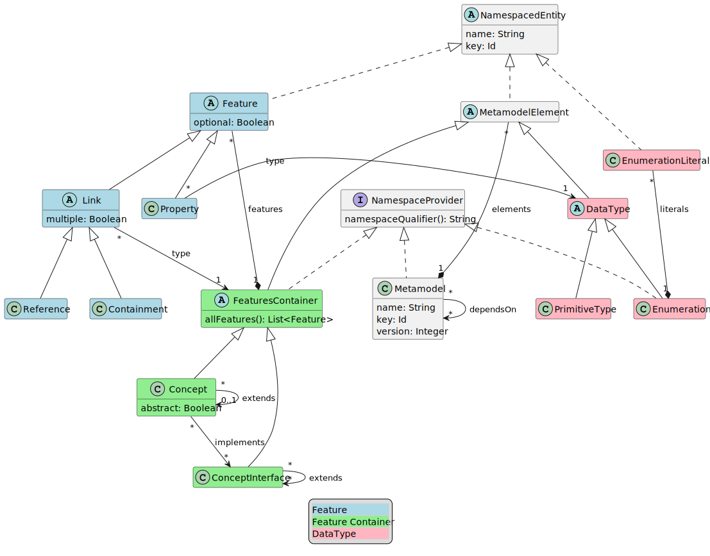

= Meta-Metamodel
:toc: preamble
:toclevels: 3
:sectnums:
:experimental: This part of LionCore is still under discussion.

In this document we describe the Meta-Metamodel to be used by LionWeb.
The Meta-Metamodel is called LionCore.

[[goals]]
== Goals

The goal is to define a meta-metamodel that can be used in different contexts and implemented from different languages.

The approach taken would be conservative: we want to provide boring and proven infrastructure, so that innovation can be built on top of it.

This will be based on the experience that we as a community had with the meta-metamodel used in EMF and MPS mainly.
Suggestions based on the experience obtained with other meta-metamodels are also very welcome.

== Languages supported

We aim to have the initial implementations being available in Java and Typescript.
We are interested in implementing it in other languages too, but not as part of the initial effort.

== What kind of models should be expressible?

Any kind of model.
In other words, models specified using metamodels expressed through this Meta-Metamodel should not make any assumptions on the node being obtained from parsing text or a graphical modeling tool or a projectional editor.
All these possible origins should be supported, with specific extensions were necessary.

For example, metamodels should be expressed to define:

* The Abstract Syntax Tree (AST) of existing textual programming languages such as Java, RPG, Python, or SAS

* The Abstract Syntax Tree (AST) of DSLs backed by projectional editors.
For example, DSLs used to define tax calculations or automation rules for email marketing systems

== Overview

Let’s first see a representation of the meta-metamodel using (a tiny subset of) the UML’s class diagram notation.

[plantuml, metametamodel, svg]
----
include::metametamodel.puml[]
----

[mermaid, metametamodel-mermaid, svg]
----
classDiagram

class Concept{
    Boolean abstract
}
FeaturesContainer <|-- Concept

class ConceptInterface
FeaturesContainer <|-- ConceptInterface

class Containment
Link <|-- Containment

class DataType
<<abstract>> DataType
MetamodelElement <|-- DataType

class Enumeration
DataType <|-- Enumeration
NamespaceProvider <|.. Enumeration

class EnumerationLiteral
NamespacedEntity <|-- EnumerationLiteral

class Feature {
    Boolean optional
}
<<abstract>> Feature
NamespacedEntity <|-- Feature

class FeaturesContainer {
    allFeatures() List~Feature~
}
<<abstract>> FeaturesContainer
MetamodelElement <|-- FeaturesContainer
NamespaceProvider <|.. FeaturesContainer

class Link {
    Boolean multiple
}
<<abstract>> Link
Feature <|-- Link

class Metamodel {
    String name
    Id id
}
NamespaceProvider <|.. Metamodel

class MetamodelElement
<<abstract>> MetamodelElement
NamespacedEntity <|-- MetamodelElement

class NamespacedEntity {
    String simpleName
    qualifiedName() String
    Id id
}
<<abstract>> NamespacedEntity

class NamespaceProvider {
    namespaceQualifier() String
}
<<interface>> NamespaceProvider

class PrimitiveType
DataType <|-- PrimitiveType

class Property
Feature <|-- Property

class Reference
Link <|-- Reference

%% relations:

Concept "*" --> "0..1" Concept: extends
Concept "*" --> "*" ConceptInterface: implements

ConceptInterface "*" --> "*" ConceptInterface: extends

EnumerationLiteral "*" --* "1" Enumeration : literals

Feature "*" --* "1" FeaturesContainer: features

Link "*" --> "1" FeaturesContainer: type

Metamodel "*" --> "*" Metamodel: dependsOn
MetamodelElement "*" --* "1" Metamodel: elements

Property "*" --> "1" DataType: type
----

== Definition of the Meta-Metamodel

In this section we describe the single elements composing the Meta-Metamodel.
We will list elements by their type: classes, abstract classes and interfaces.

=== Classes

The classes are <<Metamodel>>, <<Concept>>, <<ConceptInterface>>, <<PrimitiveType>>, <<Enumeration>>, <<EnumerationLiteral>>, <<Typedef>>, <<Annotation>>, <<Containment>>, <<Reference>>, and <<Property>>.

[[Metamodel]]
==== Metamodel
A Metamodel will provide the Concepts necessary to describe ideas in a particular domain together with supporting elements necessary for the definition of those Concepts.

It also represents the namespace within which Concepts and other supporting elements are organized.

.Example
For example, a Metamodel for accounting could collect several Concepts such as _Invoice_, _Customer_, _InvoiceLine_, _Product_.
It could also contain related elements necessary for the definitions of the concepts.
For example, a DataType named Currency.

.EMF & MPS equivalent
A Metamodel in LionWeb will be roughly equivalent to an `EPackage` or the contents of the _structure aspect_ of an MPS Language.

A Metamodel will not have a URI or a prefix, differently from EPackages.

A Metamodel will not have a version number, differently from MPS Languages.

Differently from EPackages and MPS Languages, there is no way to group metamodel elements.
EPackages have instead sub-packages and MPS Languages have virtual folders.
For this use case, different Metamodels could be used instead.

.Characteristics
A Metamodel has a [[Metamodel.name, Metamodel.name]]`name` and an [[Metamodel.id, Metamodel.id]]`id`, similarly to MPS Languages.

[[Metamodel.elements, Metamodel.elements]]
Each Metamodel will contain a list of <<MetamodelElement, Metamodel elements>> in its `elements` containment.

A Metamodel is a <<NamespaceProvider>> (as it provides a Namespace to all its elements).

[[Metamodel.dependsOn, Metamodel.dependsOn]]
A Metamodel can depend on other Metamodels via `dependsOn` reference.
Dependencies must be explicitly declared.

.Constraints
Metamodel elements contained in a Metamodel are allowed to refer exclusively to Metamodel elements contained in the same Metamodel or in Metamodel explicitly declared as dependencies by the current metamodel.

Dependencies are not transitive: e.g., if A declares a dependency on B, and B declares a dependency on C, still references to C cannot appear within A, unless C is added to the list of dependencies of A.

[[Concept]]
==== Concept
A Concept represents a category of entities sharing the same structure.

.Example
For example, _Invoice_ would be a Concept.
Single entities could be Concept instances, such as Invoice #1/2022.

.EMF & MPS equivalent
A Concept is roughly equivalent to an `EClass` (with the `isInterface` flag set to `false`) or an MPS’s `ConceptDeclaration`.

.Characteristics
A Concept has a <<NamespacedEntity.simpleName, `simpleName`>> and an <<NamespacedEntity.id, `id`>>.

[[Concept.abstract, Concept.abstract]]
A Concept can be concrete (i.e., instantiable) or abstract, marked by boolean `abstract` property.

A Concept is a <<FeaturesContainer>>  (as it has features).
It is indirectly a <<MetamodelElement>> (as it is a top level element in a <<Metamodel>>), a <<NamespacedEntity>> (as it has an identity and it is contained in the namespace of the Metamodel), and a <<NamespaceProvider>> (as it act as the namespace for its features).

[[Concept.extends, Concept.extends]]
Each Concept `extends` zero or one Concepts.
If no Concepts are explicitly extended, the Concept will implicitly extend the Concept named `BaseConcept`.
`BaseConcept` is the only concept that truly does not extend any Concept.

[[Concept.implements, , Concept.implements]]
A Concept `implements` zero or more <<ConceptInterface, ConceptInterfaces>>.

A Concept can have any number of <<FeaturesContainer.features, `features`>>, given it is a <<FeaturesContainer>>.

.Constraints
TBD

[[ConceptInterface]]
==== ConceptInterface
A ConceptInterface represents a category of entities sharing some similar characteristics.

.Example
For example, `Named` would be a ConceptInterface.

.EMF & MPS equivalent
A ConceptInterface in LionWeb will be roughly equivalent to an `EClass` (with the `isInterface` flag set to `true`) or an MPS’s `ConceptInterfaceDeclaration`.

.Characteristics
A ConceptInterface has a <<NamespacedEntity.simpleName, `simpleName`>> and an <<NamespacedEntity.id, `id`>>.

A ConceptInterface is an <<FeaturesContainer>>  (as it has features).
It is indirectly a <<MetamodelElement>> (as it is a top level element in a <<Metamodel>>), a <<NamespacedEntity>> (as it has an identity and it is contained in the namespace of the Metamodel), and a <<NamespaceProvider>> (as it act as the namespace for its features).

[[ConceptInterface.extends, ConceptInterface.extends]]
Each ConceptInterface `extends` zero or more ConceptInterfaces.

A ConceptInterface can have any number of <<FeaturesContainer.features, `features`>>, given it is a <<FeaturesContainer>>.

.Constraints
{empty}

WARNING: {experimental}

A ConceptInterface can only declare features marked as derived.

[[PrimitiveType]]
==== PrimitiveType
This represents an arbitrary primitive value, which is not an <<Enumeration>>.

.Example
_BooleanType_, _NumberType_, and _StringType_ are common PrimitiveTypes.

.EMF & MPS equivalent
A PrimitiveType is similar to Ecore’s `EDataType` and to MPS’ `PrimitiveDataTypeDeclaration`.

Differently from ECore’s `EDataType` PrimitiveType has no flag `serializable`, and it does not inherit fields such as `instanceClassName`, `instanceClass`, or `defaultValue`.

.Characteristics
A PrimitiveType has a <<NamespacedEntity.simpleName, `simpleName`>> and an <<NamespacedEntity.id, `id`>>.

A PrimitiveType is a <<DataType>> (as it can be used as <<Property.type, type>> of a <<Property>>).
It is indirectly a <<MetamodelElement>> (as it is a top level element in a <<Metamodel>>) and a <<NamespacedEntity>> (as it has an identity and it is contained in the namespace of the Metamodel).

The correspondence between a PrimitiveType an implementation class on a specific platforms can be specified through annotations, but it is not specified on the PrimitiveType itself.

.Constraints
TBD

[[Enumeration]]
==== Enumeration
A primitive value with finite, pre-defined, known set of possible values.

.Example
_DaysOfWeek_ or _PlayingCardSuit_ are common Enumerations.

.EMF & MPS equivalent
An Enumeration is similar to Ecore’s `EEnum` and to MPS’ `EnumerationDeclaration`.

Differently from ECore’s `EEnum` Enumeration has no flag `serializable`, and it does not inherit fields such as `instanceClassName`, `instanceClass`, or `defaultValue`.

.Characteristics
An Enumeration has a <<NamespacedEntity.simpleName, `simpleName`>> and an <<NamespacedEntity.id, `id`>>.

[[Enumeration.literals, Enumeration.literals]]
An Enumeration contains <<EnumerationLiteral, EnumerationLiterals>> in its `literals` containment.

An Enumeration is a <<DataType>> (as it can be used as <<Property.type, type>> of a <<Property>>) and a <<NamespaceProvider>> (as it act as the namespace for its literals).
It is indirectly a <<MetamodelElement>> (as it is a top level element in a <<Metamodel>>) and a <<NamespacedEntity>> (as it has an identity and it is contained in the namespace of the Metamodel).

.Constraints
TBD

[[EnumerationLiteral]]
==== EnumerationLiteral
One of the possible values of an <<Enumeration>>.

.Example
_Monday_, _Tuesday_, _Wednesday_, _Thursday_, _Friday_, _Saturday_ and _Sunday_ are all EnumerationLiterals of the _DaysOfWeek_ Enumeration.

.EMF & MPS equivalent
An EnumerationLiteral is similar to Ecore’s `EEnumLiteral` and to MPS’ `EnumerationMemberDeclaration`.

.Characteristics
An EnumerationLiteral has a <<NamespacedEntity.simpleName, `simpleName`>> and an <<NamespacedEntity.id, `id`>>.

An Enumeration is a <<NamespacedEntity>> (as it has an identity and it is contained in the namespace of its <<Enumeration>>).

.Constraints
TBD

[[Typedef]]
==== Typedef

WARNING: {experimental}

TODO: add an entry

[[Annotation]]
==== Annotation

WARNING: {experimental}

This represents additional metadata relative to some orthogonal concern.

.Example
_DocumentationComment_ could be specified as an annotation.

.EMF & MPS equivalent
This is similar to Ecore’s `EAnnotation`, and to MPS’s `NodeAttribute`.

`EcoreAnnotation` has a `source` of type string.
This will typically be a full URI representing the type of the annotation.
It also has a details field, which is a map from String to String.
It contains tagged values.

`NodeAttribute` is a particular abstract Concept, which can be extended and have properties and links like other Concepts.

.Characteristics
[[Annotation.platformSpecific, Annotation.platformSpecific]]
An annotation can be meaningful for a specific platform, identified by a name.
For this reason Annotation has a field `platformSpecific` of type String?.

An Annotation is a <<MetamodelElement>>, a <<NamespaceProvider>>, and a <<FeaturesContainer>>.
However, it is forbidden for Annotations to have <<Containment, Containments>>.
An Annotation can have as <<Feature, Features>> only <<Reference, References>> and <<Property, Properties>>.

[[Annotation.target, Annotation.target]]
An Annotation is related to its `target`, which is an <<FeaturesContainer>>.
It indicates that the Annotation can be applied to instances of that specific AbstractConcept.
A `target` must be always specified, and it can possibly be the `BaseConcept`, representing all concepts.

[[Containment]]
==== Containment
Represents a relation between a containing <<FeaturesContainer>> and a contained <<FeaturesContainer>>.

.Example
Between an _IfStatement_ and its _condition_ there is a Containment relation.

.EMF & MPS equivalent
A Containment is similar to an ECore’s `EReference` with the `containment` flag set to `true`.
Differently from an `EReference` there is no `container` flag and `resolveProxies` flag.

A Containment is similar to an MPS’s `LinkDeclaration` with `metaClass` having value `aggregation`.
Differently from a `LinkDeclaration` there is no field `unordered`.

.Characteristics
A Containment has a <<NamespacedEntity.simpleName, `simpleName`>> and an <<NamespacedEntity.id, `id`>>.
It can be marked as <<Feature.optional, `optional`>> and <<Link.multiple, `multiple`>>.

A Containment refers its <<Link.type, `type`>>, which is a <<FeaturesContainer>>.

A Containment is a <<Link>> (as it describes a relation between two FeaturesContainers).
It is indirectly a <<Feature>> (as it describes the characteristics of a <<FeaturesContainer>>) and a <<NamespacedEntity>> (as it has an identity and it is contained in the namespace of its FeaturesContainer).

WARNING: {experimental}

[[specialization]]
A Containment can optionally be a _specialization_ of another Containment.
In that case, the original Containment must appear in a <<Concept>> extended by the Concept containing the specializing Containment or in an <<ConceptInterface>> implemented by the specializing Containment.
A Containment can only specialize a Containment with the same name.

.Constraints
TBD

[[Reference]]
==== Reference
Represents a relation between a referring <<FeaturesContainer>> and referred <<FeaturesContainer>>.

.Example
_VariableReference_ may have a Reference to a _VariableDeclaration_.

.EMF & MPS equivalent
A Reference is similar to an ECore’s `EReference` with the `containment` flag set to `false`.
Differently from an `EReference` there is no `container` flag and `resolveProxies` flag.

A Reference is similar to an MPS’s `LinkDeclaration` with `metaClass` having value `reference`.
Differently from a `LinkDeclaration` there is no field `unordered`.

.Characteristics
A Reference has a <<NamespacedEntity.simpleName, `simpleName`>> and an <<NamespacedEntity.id, `id`>>.
It can be marked as <<Feature.optional, `optional`>> and <<Link.multiple, `multiple`>>.

A Containment refers its <<Link.type, `type`>>, which is a <<FeaturesContainer>>.

A Reference is a <<Link>> (as it describes a relation between two FeaturesContainers).
It is indirectly a <<Feature>> (as it describes the characteristics of a <<FeaturesContainer>>) and a <<NamespacedEntity>> (as it has an identity and it is contained in the namespace of its FeaturesContainer).

WARNING: {experimental}

A Reference can optionally be a _specialization_ of another Reference.
In that case, the original Reference must appear in a <<Concept>> extended by the Concept containing the specializing Reference or in an <<ConceptInterface>> implemented by the specializing Reference.
A Reference can only specialize a Reference with the same name.

.Constraints
TBD

[[Property]]
==== Property
This indicates a simple value associated to an entity.

.Example
For example, an _Invoice_ could have a _date_ or an _amount_.

.EMF & MPS equivalent
A Property is similar to Ecore’s `EAttribute`.

A Property is similar to MPS’s `AttributeDeclaration`.

.Characteristics
A Property has a <<NamespacedEntity.simpleName, `simpleName`>> and an <<NamespacedEntity.id, `id`>>.
It can be marked as <<Feature.optional, `optional`>>.

[[Property.type, Property.type]]
A Property refers its `type`, which is a <<DataType>>.

A Property is a <<Feature>> (as it describes the characteristics of a <<FeaturesContainer>>).
It is indirectly a <<NamespacedEntity>> (as it has an identity and it is contained in the namespace of its FeaturesContainer).

.Constraints
TBD

=== Abstract Classes

The abstract classes are <<NamespacedEntity>>, <<MetamodelElement>>, <<FeaturesContainer>>, <<DataType>>, <<Feature>>, and <<Link>>.

[[NamespacedEntity]]
==== NamespacedEntity
Something with a name and contained in a Namespace.

.Example
A Concept _Invoice_, contained in a Metamodel `com.foo.Accounting`.
Therefore, _Invoice_ will have the qualifiedName `com.foo.Accounting.Invoice`.

.EMF & MPS equivalent
n/a

.Characteristics
[[NamespacedEntity.simpleName, NamespacedEntity.simpleName]]
A NamespacedEntity has a `simpleName`.

[[NamespacedEntity.id, NamespacedEntity.id]]
A NamespacedEntity has an `id`.

It can calculate the `qualifiedName` by combining the name of the namespace, which it can obtain from its own <<NamespaceProvider>>.

.Constraints
A NamespaceEntity's `simpleName` must be unique within the NamespaceProvider.

[[MetamodelElement]]
==== MetamodelElement
A MetamodelElement is an element with an identity within a <<Metamodel>>.

.Example
For example, _Invoice_, _Currency_, _Named_, or _String_ could be MetamodelElements.

.EMF & MPS equivalent
MetamodelElement is similar to Ecore’s `EClassifier`.

MetamodelElement is similar to MPS’ `IStructureElement`.
The difference is that `IStructureElement` includes also elements that cannot appear as top level elements of a structure aspects, such as `LinkDeclaration`, `PropertyDeclaration`, and `EnumerationMemberDeclaration`.

.Characteristics
A MetamodelElement has a <<NamespacedEntity.simpleName, `simpleName`>> and an <<NamespacedEntity.id, `id`>>.

A MetamodelElement is a <<NamespacedEntity>> (as it has an identity and it is contained in the namespace of its <<Metamodel>>).

A MetamodelElement can be one of:

* <<Concept>>
* <<ConceptInterface>>
* <<PrimitiveType>>
* <<Enumeration>>
* <<Annotation>> ({experimental})

The `qualifiedName` of a MetamodelElement can be obtained by combining the name of the containing <<Metamodel>> with the name of the Concept.

.Constraints
Each MetamodelElement must have a unique `simpleName` within the Metamodel.

Each MetamodelElement belongs to one and only one Metamodel.

[[FeaturesContainer]]
==== FeaturesContainer
Something which can own <<Feature, Features>>.

.Example
A Concept can have several features.

.EMF & MPS equivalent
FeaturesContainer is similar to `EClass` in Ecore (which is used both for classes and interfaces) and to `AbstractConceptDeclaration` in MPS.

.Characteristics
A FeaturesContainer has a <<NamespacedEntity.simpleName, `simpleName`>> and an <<NamespacedEntity.id, `id`>>.

[[FeaturesContainer.features, FeaturesContainer.features]]
A FeaturesContainer owns any number of <<Feature, Features>> in `features` containment.

A FeaturesContainer can be one of:

* <<Concept>>
* <<ConceptInterface>>
* <<Annotation>> ({experimental})

A FeaturesContainer is a <<MetamodelElement>> (as it is a top level element in a <<Metamodel>>) and a <<NamespaceProvider>> (as it act as the namespace for its features).
It is indirectly a <<NamespacedEntity>> (as it has an identity and it is contained in the namespace of the Metamodel).

.Constraints
TBD

[[DataType]]
==== DataType
A type of value which has not a relevant identity in the context of a model.

.Example
A _Currency_ or a _Date_ type.

.EMF & MPS equivalent
It is similar to Ecore’s `EDataType`.

It is similar to MPS’ `DataTypeDeclaration`.

.Characteristics
A DataType has a <<NamespacedEntity.simpleName, `simpleName`>> and an <<NamespacedEntity.id, `id`>>.

A DataType is a <<MetamodelElement>> (as it is a top level element in a <<Metamodel>>).
It is indirectly a <<NamespacedEntity>> (as it has an identity and it is contained in the namespace of the Metamodel).

A DataType can be one of:

* <<PrimitiveType>>
* <<Enumeration>>

.Constraints
TBD

[[Feature]]
==== Feature
A Feature represents a characteristic or some form of data associated with a particular concept.

.Example
For example, an _Invoice_ can have an associated _date_, a _number_, a connection with a _customer_, and it can contain _InvoiceLines_.
All of this information is represented by features.

.EMF & MPS equivalent
A Feature in LionWeb will be roughly equivalent to an `EStructuralFeature` or to the combination of `Properties` and `Links` (both containment and reference links) in MPS.

Differently from Ecore’s `EStructureFeature`, Features do not have flags such as `changeable`, `volatile`, `transient`, or `unsettable`.
They have no `default value`.

.Characteristics
A Feature has a <<NamespacedEntity.simpleName, `simpleName`>> and an <<NamespacedEntity.id, `id`>>.

[[Feature.optional, Feature.optional]]
A Feature can be set to `optional` or required.

A Feature is a <<NamespacedEntity>> (as it has an identity and it is contained in the namespace of the <<FeaturesContainer>>).

A Feature can either be one of:

* <<Property>>
* <<Containment>>
* <<Reference>>

WARNING: {experimental}

[[Feature.derived, Feature.derived]]
.Derived Features (aka Calculated Features)
A Feature can be _derived_ if its value is not stored in the Node itself but it can be obtained by accessing the other features’ values or other sources of information.
Properties and References can be derived but not Containments.

* Implemented in host language (i.e. there's no way to define Derive Feature semantics in LionWebCore)
* If derived feature with same signature is inherited from several interfaces, need to override it explicitly.

.Constraints
Each Feature must have a unique name within a specific <<FeaturesContainer>>, also considering all inherited features which are not specialized.

[[Link]]
==== Link
Represent a connection to an <<FeaturesContainer>>.

.Example
An _Invoice_ can be connected to its _InvoiceLines_ and to a _Customer_.

.EMF & MPS equivalent
It is similar to Ecore’s `EReference`.

It is similar to MPS’ `LinkDeclaration`.

.Characteristics
A Link has a <<NamespacedEntity.simpleName, `simpleName`>> and an <<NamespacedEntity.id, `id`>>.
It can be marked as <<Feature.optional, `optional`>>.

[[Link.multiple, Link.multiple]]
A Link can have `multiple` or only a single targets.

[[Link.type, Link.type]]
A Link refers its `type`, which is a <<FeaturesContainer>>.

A Link is a <<Feature>> (as it describes the characteristics of a <<FeaturesContainer>>).
It is indirectly a <<NamespacedEntity>> (as it has an identity and it is contained in the namespace of its FeaturesContainer).

A Link can be either a <<Containment>>, or a <<Reference>>.

.Constraints
TBD

=== Interfaces

The interfaces are <<NamespaceProvider>>.

[[NamespaceProvider]]
==== NamespaceProvider
Something which can act as the namespace for contained named things.

.Example
A Metamodel `com.foo.Accounting` can be the NamespaceProvider for a Concept _Invoice_, which will therefore have the qualifiedName `com.foo.Accounting.Invoice`.

.EMF & MPS equivalent
n/a

.Characteristics
[[NamespaceProvider.namespaceQualifier, NamespaceProvider.namespaceQualifier]]
A NamespaceProvider can calculate the `namespaceQualifier` exposed to its children.
This is typically calculated by combining the namespaces of all the ancestors up to the top level ancestor.

.Constraints
TBD

=== Supporting Terminology
==== Multiplicity
Multiplicity describes how many targets a link must and can have.

.Example
Common multiplicities are `1` (meaning there MUST be exactly one target), `0..1` (meaning there CAN be exactly one target), `0..\*` (meaning there CAN be zero or more targets), and `1..*` (meaning there MUST be at least one target, but there CAN be more than one targets).

.EMF & MPS equivalent
In Ecore there is no equivalent as `lowerBound` and `upperBound` can be set independently.

This is equivalent to MPS’ `Cardinality`, which has the four values mentioned as example.

.Characteristics
LionCore represents multiplicity as the two booleans <<Feature.optional, `optional`>> (whether there MUST be at least one target) and <<Link.multiple, `multiple`>> (whether there CAN be more than one target).

[%autowidth]
|===
|Multiplicity |`optional` |`multiple`
|`1` |true |false
|`0..1` |false |false
|`0..*` |true |true
|`1..*` |false |true
|===

.Constraints
TBD

== Other considerations

=== Pre-defined concepts

`BaseConcept`, a <<Concept>> that's the (explicit or implicit) the ancestor of all concepts.

=== Pre-defined primitive types

Some <<PrimitiveType, primitive types>> will be widely used, so it makes sense to pre-define them.

* [[Boolean, Boolean]] `Boolean`
* [[String, String]] `String`
* [[Integer, Integer]] `Integer`
* [[JSON, JSON]] `JSON`

WARNING: {experimental}

* `Date`
* `DateTime`
* `Character`
* `Number`: this is a problem as we have different ways to represent numbers with different levels of precision on different platforms.
Our proposed solution is to indicate numbers purely as numbers and to specify constraints and implementation details through annotations

=== Pre-defined annotations

WARNING: {experimental}

We will ship a set of predefined annotations whose semantics can be relied on by tools.
At this point, we will not yet standardize them, but here are some ideas:

[horizontal]
`@doc`:: Documentation
`@todo`:: Something to be fixed later
`@deprecated(string)`:: please don't use
`@origin`:: location pointer for textual files in a parsed scenario
`@helpercrap`:: not a real domain concept, just a technical artifact
`@merge(policy)`:: avoid merge conflicts for things like layout position (always accept theirs)
`@main`:: main slot à la Intentional: default for wrapping and unwrapping in editors
Constraints:: annotation can be used also to define constraints on strings like ID or qualified ID or @unsigned
platform specific annotations:: for things like number sizes. E.g., @java:int,
`@java:class`:: to indicate to which Java class to map a primitiveType

=== Reflection

Reflection describes the ability of each Meta-Metamodel instance to access the definition of the Meta-Metamodel element from which it has been instantiated.

It is important to offer this functionality also in consideration that some implementation languages may not offer reflection capabilities that could be used as an alternative.

=== Generics

Generics are not directly supported by this proposal.
We can solve some needs through specialization of features in derived classes.
We could alternatively also imagine using specific annotations for supporting this.

In general Generics complicate the solution and MPS can live without them.
Also, in StarLasu we never encountered the need for them so far.

=== Identifiers

==== Valid characters

Ids can only contain these symbols:

* lowercase latin characters: `a`..`z`
* uppercase latin characters: `A`..`Z`
* arabic numerals: `0`..`9`
* underscore: `_`
* hyphen: `-`

This is the same character set as https://en.wikipedia.org/wiki/Base64#Variants_summary_table[Base64url variant].

==== Representation

Ids are represented by a string, containing only valid characters (as defined above).
An id string is NOT padded, also not by whitespaces.
An id string does NOT contain any terminating symbols (compared to some BASE64 variants); this does not affect internal representation in a specific implementation language, e.g. C-style \0-terminated strings.

==== Scope

Node ids MUST be unique within their id-space.

===== Id-space

An id-space is a realm that guarantees the uniqueness of all ids within.
Typically, this means one repository.

An id-space has an id as defined above.
Uniqueness of id-space ids is out of scope of LIonWeb specification.

In LIonWeb (the protocol), id-spaces are NOT hierarchical.
An implementation might choose to use hierarchical id-spaces internally.

==== Identification

A node can be identified relative to its id-space by the node's id.
To globally identify a node, we use the combination of the id-space id and the node id.

==== Ids of M3 Elements

[cols="d,d,m"]
|===
|M3 element |Concept |Id

|<<Concept>> |Concept |LIonCore_M3_Concept
|<<Concept.abstract>> |Property |LIonCore_M3_Concept_abstract
|<<Concept.extends>> |Reference |LIonCore_M3_Concept_extends
|<<Concept.implements>> |Reference |LIonCore_M3_Concept_implements
|<<ConceptInterface>> |Concept |LIonCore_M3_ConceptInterface
|<<ConceptInterface.extends>> |Reference |LIonCore_M3_ConceptInterface_extends
|<<Containment>> |Concept |LIonCore_M3_Containment
|<<DataType>> |Concept |LIonCore_M3_DataType
|<<Enumeration>> |Concept |LIonCore_M3_Enumeration
|<<Enumeration.literals>> |Containment |LIonCore_M3_Enumeration_literals
|<<EnumerationLiteral>> |Concept |LIonCore_M3_EnumerationLiteral
|<<Feature>> |Concept |LIonCore_M3_Feature
|<<Feature.optional>> |Property |LIonCore_M3_Feature_optional
|<<FeaturesContainer>> |Concept |LIonCore_M3_FeaturesContainer
|<<FeaturesContainer.features>> |Containment |LIonCore_M3_FeaturesContainer_features
|<<Link>> |Concept |LIonCore_M3_Link
|<<Link.multiple>> |Property |LIonCore_M3_Link_multiple
|<<Link.type>> |Reference |LIonCore_M3_Link_type
|<<Metamodel>> |Concept |LIonCore_M3_Metamodel
|<<Metamodel.name>> |Property |LIonCore_M3_Metamodel_name
|<<Metamodel.id>> |Property |LIonCore_M3_Metamodel_id
|<<Metamodel.dependsOn>> |Reference |LIonCore_M3_Metamodel_dependsOn
|<<Metamodel.elements>> |Containment |LIonCore_M3_Metamodel_elements
|<<MetamodelElement>> |Concept |LIonCore_M3_MetamodelElement
|<<NamespacedEntity>> |Concept |LIonCore_M3_NamespacedEntity
|<<NamespacedEntity.simpleName>> |Property |LIonCore_M3_NamespacedEntity_simpleName
|<<NamespacedEntity.id>> |Property |LIonCore_M3_NamespacedEntity_id
|<<NamespaceProvider>> |Concept |LIonCore_M3_NamespaceProvider
|<<PrimitiveType>> |Concept |LIonCore_M3_PrimitiveType
|<<Property>> |Concept |LIonCore_M3_Property
|<<Property.type>> |Reference |LIonCore_M3_Property_type
|<<Reference>> |Concept |LIonCore_M3_Reference
|===

==== Ids of Built-in Instances

[cols="d,d,m"]
|===
|Instance |Concept |Id

|<<String>> |PrimitiveType |LIonCore_M3_String
|<<Boolean>> |PrimitiveType |LIonCore_M3_Boolean
|<<Integer>> |PrimitiveType |LIonCore_M3_Integer
|<<JSON>> |PrimitiveType |LIonCore_M3_JSON
|===

=== Union or Intersection Types

These are not supported.

=== Operations

Operations are not represented in the Meta-Metamodel.

== Comparison with other meta-metamodels

Main difference: we aim for multiple implementations on different platforms, we want to serve both textual and projectional languages and editors.

[%autowidth]
|===
|LIonCore |Ecore |MPS

|<<Metamodel>>
|link:https://download.eclipse.org/modeling/emf/emf/javadoc/2.11/org/eclipse/emf/ecore/EPackage.html[EPackage]
|Language's structure aspect
(link:https://www.jetbrains.com/help/mps/structure.html[docs],
link:https://alexanderpann.github.io/mps-openapi-doc/javadoc_2021.2/org/jetbrains/mps/openapi/language/SLanguage.html[javadoc])

|<<Concept>>
|link:https://download.eclipse.org/modeling/emf/emf/javadoc/2.11/org/eclipse/emf/ecore/EClass.html[EClass]
|link:http://127.0.0.1:63320/node?ref=r%3A00000000-0000-4000-0000-011c89590292%28jetbrains.mps.lang.structure.structure%29%2F1071489090640[ConceptDeclaration]
(link:https://www.jetbrains.com/help/mps/structure.html#conceptsandconceptinterfaces[docs],
link:https://alexanderpann.github.io/mps-openapi-doc/javadoc_2021.2/org/jetbrains/mps/openapi/language/SConcept.html[javadoc])

|<<ConceptInterface>>
|link:https://download.eclipse.org/modeling/emf/emf/javadoc/2.11/org/eclipse/emf/ecore/EClass.html[EClass]
|link:http://127.0.0.1:63320/node?ref=r%3A00000000-0000-4000-0000-011c89590292%28jetbrains.mps.lang.structure.structure%29%2F1169125989551[InterfaceConceptDeclaration]
(link:https://www.jetbrains.com/help/mps/structure.html#conceptsandconceptinterfaces[docs],
link:https://alexanderpann.github.io/mps-openapi-doc/javadoc_2021.2/org/jetbrains/mps/openapi/language/SInterfaceConcept.html[javadoc])

|<<PrimitiveType>>
|link:https://download.eclipse.org/modeling/emf/emf/javadoc/2.11/org/eclipse/emf/ecore/EDataType.html[EDataType]
|link:http://127.0.0.1:63320/node?ref=r%3A00000000-0000-4000-0000-011c89590292%28jetbrains.mps.lang.structure.structure%29%2F1083243159079[PrimitiveDataTypeDeclaration]
(link:https://alexanderpann.github.io/mps-openapi-doc/javadoc_2021.2/org/jetbrains/mps/openapi/language/SPrimitiveDataType.html[javadoc])

|<<Enumeration>>
|link:https://download.eclipse.org/modeling/emf/emf/javadoc/2.11/org/eclipse/emf/ecore/EEnum.html[EEnum]
|link:http://127.0.0.1:63320/node?ref=r%3A00000000-0000-4000-0000-011c89590292%28jetbrains.mps.lang.structure.structure%29%2F3348158742936976479[EnumerationDeclaration]
(link:https://www.jetbrains.com/help/mps/structure.html#enumerationds[docs],
link:https://alexanderpann.github.io/mps-openapi-doc/javadoc_2021.2/org/jetbrains/mps/openapi/language/SEnumeration.html[javadoc])

|<<EnumerationLiteral>>
|link:https://download.eclipse.org/modeling/emf/emf/javadoc/2.11/org/eclipse/emf/ecore/EEnumLiteral.html[EEnumLiteral]
|link:http://127.0.0.1:63320/node?ref=r%3A00000000-0000-4000-0000-011c89590292%28jetbrains.mps.lang.structure.structure%29%2F3348158742936976480[EnumerationMemberLiteral]
(link:https://www.jetbrains.com/help/mps/structure.html#enumerationds[docs],
link:https://alexanderpann.github.io/mps-openapi-doc/javadoc_2021.2/org/jetbrains/mps/openapi/language/SEnumerationLiteral.html[javadoc])

|<<Containment>>
|link:https://download.eclipse.org/modeling/emf/emf/javadoc/2.11/org/eclipse/emf/ecore/EReference.html[EReference]
|link:http://127.0.0.1:63320/node?ref=r%3A00000000-0000-4000-0000-011c89590292%28jetbrains.mps.lang.structure.structure%29%2F1071489288298[LinkDeclaration]
(link:https://www.jetbrains.com/help/mps/structure.html#children[docs],
link:https://alexanderpann.github.io/mps-openapi-doc/javadoc_2021.2/org/jetbrains/mps/openapi/language/SContainmentLink.html[javadoc])

|<<Reference>>
|link:https://download.eclipse.org/modeling/emf/emf/javadoc/2.11/org/eclipse/emf/ecore/EReference.html[EReference]
|link:http://127.0.0.1:63320/node?ref=r%3A00000000-0000-4000-0000-011c89590292%28jetbrains.mps.lang.structure.structure%29%2F1071489288298[LinkDeclaration]
(link:https://www.jetbrains.com/help/mps/structure.html[docs],
link:https://alexanderpann.github.io/mps-openapi-doc/javadoc_2021.2/org/jetbrains/mps/openapi/language/SReferenceLink.html[javadoc])

|<<Property>>
|link:https://download.eclipse.org/modeling/emf/emf/javadoc/2.11/org/eclipse/emf/ecore/EAttribute.html[EAttribute]
|link:http://127.0.0.1:63320/node?ref=r%3A00000000-0000-4000-0000-011c89590292%28jetbrains.mps.lang.structure.structure%29%2F1071489288299[PropertyDeclaration]
(link:https://www.jetbrains.com/help/mps/structure.html#properties[docs],
link:https://alexanderpann.github.io/mps-openapi-doc/javadoc_2021.2/org/jetbrains/mps/openapi/language/SProperty.html[javadoc])

|<<NamespacedEntity>>
|--
|--

|<<MetamodelElement>>
|link:https://download.eclipse.org/modeling/emf/emf/javadoc/2.11/org/eclipse/emf/ecore/EClassifier.html[EClassifier]
|link:http://127.0.0.1:63320/node?ref=r%3A00000000-0000-4000-0000-011c89590292%28jetbrains.mps.lang.structure.structure%29%2F1588368162880706270[IStructureElement]
(link:https://alexanderpann.github.io/mps-openapi-doc/javadoc_2021.2/org/jetbrains/mps/openapi/language/SElement.html[javadoc])

|<<FeaturesContainer>>
|link:https://download.eclipse.org/modeling/emf/emf/javadoc/2.11/org/eclipse/emf/ecore/EClass.html[EClass]
|link:http://127.0.0.1:63320/node?ref=r%3A00000000-0000-4000-0000-011c89590292%28jetbrains.mps.lang.structure.structure%29%2F1169125787135[AbstractConceptDeclaration]
(link:https://alexanderpann.github.io/mps-openapi-doc/javadoc_2021.2/org/jetbrains/mps/openapi/language/SAbstractConcept.html[javadoc])

|<<DataType>>
|link:https://download.eclipse.org/modeling/emf/emf/javadoc/2.11/org/eclipse/emf/ecore/EDataType.html[EDataType]
|link:http://127.0.0.1:63320/node?ref=r%3A00000000-0000-4000-0000-011c89590292%28jetbrains.mps.lang.structure.structure%29%2F1082978164218[DataTypeDeclaration]
(link:https://alexanderpann.github.io/mps-openapi-doc/javadoc_2021.2/org/jetbrains/mps/openapi/language/SDataType.html[javadoc])

|<<Feature>>
|link:https://download.eclipse.org/modeling/emf/emf/javadoc/2.11/org/eclipse/emf/ecore/EStructuralFeature.html[EStructuralFeature]
|
(link:https://www.jetbrains.com/help/mps/structure.html#conceptmembers[docs],
link:https://alexanderpann.github.io/mps-openapi-doc/javadoc_2021.2/org/jetbrains/mps/openapi/language/SConceptFeature.html[javadoc])

|<<Link>>
|link:https://download.eclipse.org/modeling/emf/emf/javadoc/2.11/org/eclipse/emf/ecore/EReference.html[EReference]
|link:http://127.0.0.1:63320/node?ref=r%3A00000000-0000-4000-0000-011c89590292%28jetbrains.mps.lang.structure.structure%29%2F1071489288298[LinkDeclaration]
(https://alexanderpann.github.io/mps-openapi-doc/javadoc_2021.2/org/jetbrains/mps/openapi/language/SAbstractLink.html[javadoc])

|<<NamespaceProvider>>
|--
|--

|===

=== Comparison with Ecore

link:https://download.eclipse.org/modeling/emf/emf/javadoc/2.11/org/eclipse/emf/ecore/package-summary.html[javadoc]

image:images/EcoreRelations.png[]

=== Comparison with MPS

image:images/mps-structure-language.png[]
