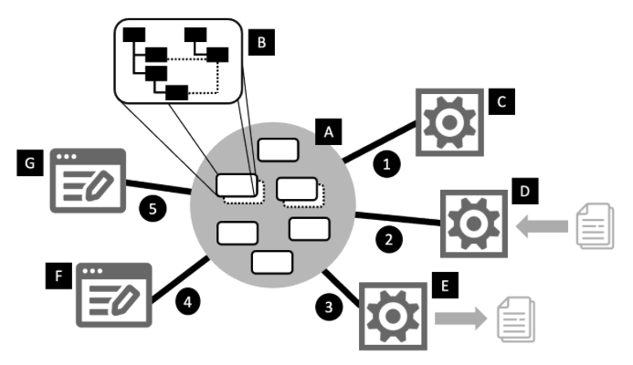

# LIonWeb -- Language Interfaces on the Web 

<strong>
The LIonWeb initiative aims to facilitate the community-based development of language engineering and modeling tools on the web. 
</strong>

1. The main focus is the definition of protocols for the communication between participating software components such as repositories and clients. To make this feasible, we also define a meta-metamodel as well as a reference architecture. 
2. Where appropriate, in order to support the protocols, LIonWeb defines programming language-level APIs to access models and metamodels and to encapsulate the protocols.  
3. A third goal of LIonWeb is to serve as a collaboration hub for the developers of such components, to empower other software developers to develop web-based modeling solutions, and to educate public about the benefits of this approach.

## Reference Architecture

A **model** is a graph structure with nodes and edges and one primary containment hierarchy [B]. Nodes are typed by a reference to a concept (a node in the metamodel of the language) and edges are named and typed (with a primitive type or a concept). Nodes also have properties which have names and primitive types. Nodes are identified by unique IDs. A LIonWeb language -- or its metamodel -- is an instance of the LIonWeb meta-metamodel.

A **repository** [A] stores models and provides clients [C,D,E,F,G] access to the nodes in a model. Conceptually, it is the center of a LIonWeb system, with clients connected to it in a star topology (although the technical architecture may be different).

**Original models** are models that cannot be (re-)computed from other models. They are CRUDed by users (mediatedby tools). Typically, they are what we'd call (a collection of) ASTs. They have to be persisted in the repository because they cannot be recomputed. **Derived models** are calculated from other (original or derived) models without direct human interaction. They are usually some form of analysis result, such as one related to a type system. Nodes in derived models are typically associated with an original node -- e.g., the type computed for an AST node. The repository manages this association. Derived models may be persisted or be recalculated on the fly.

A **client** is any program that works with models and nodes in the repository. We identify two kinds of clients, although there might be more: editors [F,G] and processors [C,D,E]. An **editor** CRUDs original models based on its direct interactions with users. A **processor** is a client that CRUDs models without direct user interaction. Processors can CRUD original models (e.g., importers [D] or generators [E]) or derived models [C] (e.g., compute type systems, desugar models, or interpret models).

One important design guideline for LIonWeb is that we treat original and derived models similarly in terms of how they are transported to and from clients and/or how they are updated.

Clients can communicate with the repository in two ways: bulk and delta. **Bulk** communication means that a client requests a set of nodes from the repository, processes those in isolation (e.g., import or otherwise crearte new nodes, modifies existing nodes, or generates output) and then writes the changed set of nodes. **Delta** communication means that, after receiving an initial snapshot similar to the bulk case, the client continues to receive changes (aka deltas) from the repo; it also writes back changes continuously. Delta communication is also the basis for multi-client realtime collaboration.

## Work Products

We aim to create the following work products (in order of descending priority):

* [Document] Specifications for the communication protocols; this also requries the definition of a meta-metamodel 
* [Document] A reference architecture for cloud-based modeling tools (necessarily mainly to be able to produce the others)
* [Code] Where appropriate, bindings for these protocols in several programming languages
* [Code] Reference implementations and examples of how to build systems using the LIonWeb protocols (in particular, using some of the systems mentioned in the History section)

In terms of how we work, we aim for a collegial atmosphere and effective technical discussions. All our specifications will be backed by working code (OMG, this is really nice!).

This project will not provide production-quality implementations for the repositories or clients; we expect this to be done by the community, for example, based on the tools mentioned in the History section.

## Participation

Currently, LIonWeb consists of nine developers, all with a long history in language engineering and modeling tools (listed in alphabetical order)

* [Meinte Boersma](https://www.dslconsultancy.com), Freelancer, The Netherlands
* Norman Koester, [itemis](http://itemis.de), Germany
* [Sergej Koscejev](https://specificlanguages.com), Freelancer, Czech Republic
* Sascha Lisson, [itemis](http://itemis.de), Germany
* Alex Shatalin, [Jetbrains (MPS Team)](https://www.jetbrains.com), Czech Republic
* Niko Stotz, [F1re](https://www.f1re.io), The Netherlands
* Federico Tomassetti, [Strumenta](https://strumenta.com), Italy
* [Markus Voelter](http://voelter.de), Freelancer, Germany
* Jos Warmer, [openmodeling](https://openmodeling.nl), The Netherlands

During the first half of 2023, we will slowly grow the set of participants based on invitation of existing participants. Later in 2023 we plan to open up for more participation.

## Legal

All our specifications and code is released as open source under the [Apache 2.0](https://www.apache.org/licenses/LICENSE-2.0). It explicitly allows commercial use. LIonWeb is currently not its own legal entity, it's just a voluntary collaboration of people.

## History

All of the initial participants have a history of working with or on [Jetbrains MPS](http://jetbrains.com/mps/) and we all appreciate its revolutionary approach of projectional editing. Most of us have also worked with [EMF](https://www.eclipse.org/modeling/emf/) and tools on top of it, in particular, [Xtext](https://www.eclipse.org/Xtext/). However, over the last few years, the need to run "something like MPS" in the browser has increased, and many of the LIonWeb founders have started developing ideas and tools around web-based language workbenches:

* [Freon](https://www.projectit.org/) by Jos Warmer, Anneke Kleppe
* [MPSServer](https://github.com/Strumenta/MPSServer) by Strumenta. It is an http and websockets server that can be started from standard and headless MPS to permit interaction with MPS from outside it. It permits to read and modify models, trigger builds, get typesystem information, etc. There is also a TypeScript client library available on NPM. It is called [MPSServer-client](https://github.com/Strumenta/mpsserver-client)
* [WebEditKit](https://github.com/Strumenta/webeditkit) by Strumenta. It is a prototypal framework for defining projectional editors that can interact with MPS through MPSServer
* [Modelix](https://github.com/modelix) by itemis, an open Source platform for models on the Web
* [StarLasu](https://github.com/Strumenta/starlasu) by Strumenta. It is a set of libraries to define and work with ASTs in Kotlin, Java, Python, TypeScript. They have been used in production for years
* Markus' [vision paper](http://voelter.de/data/pub/APlatformForSystemsAndBusinessModeling.pdf) about the future of web-based language workbenches
* [MPS](http://jetbrains.com/mps/) itself; it should also be integratable into LIonWeb-based systems.

These tools are independent and do not provide out-of-the-box interoperability. This is unfortunate because 
* None of them provides everything that's needed for an LWB in the cloud 
* Many aren't broken down into components that are exposed through a well-defined API and can be used independently
* Some provide similar functionality with different interfaces for the same kind of problem (M3 layer, model loading, e.g.)

The lack of interoperability discourages others from developing additional components. It is also hard to explain to potential users, customers, contributors, and funders why this small community hasn't been able coordinate better. We have started LIonWeb to fix these problem: **The LIonWeb initiative aims to facilitate the community-based development of language engineering and modeling tools on the web.**

