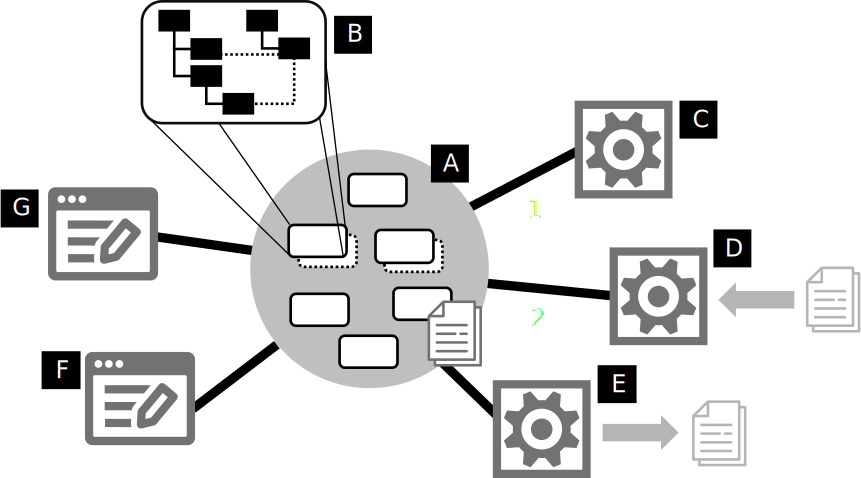

= Reference Architecture
:stylesheet: style.css

A [[repository]]*repository* [.refletter]#B# is a graph structure with nodes and edges and one primary containment hierarchy [.refletter]#B#.
You can think of a repository as a "`model`", but we like to avoid that word because it's so overused.

Nodes are typed by a reference to a concept (a node in a LionWeb language) and edges are named and typed with a concept.
A LionWeb language – or its metamodel – is an instance of the LionWeb meta-metamodel.
Nodes also have properties which have names and primitive types.
Nodes are identified by unique IDs.
// Within the graph structure one can identify *roots* which are nodes that are typed by a reference to a concept that's marked as a *partition*.

A repository is “its own universe”: nodes within it can't reference nodes, or be referenced from nodes from other repositories.
// That also means that a repository's language can only reside in another repository.
// Nodes can refer to nodes from the LionCore and built-in languages, though.

A [[server]]*server* [.refletter]#A# stores repositories and provides clients [.refletter]#C#, [.refletter]#D#, [.refletter]#E# ,[.refletter]#F#, [.refletter]#G# access to the nodes in a specific repository.
Conceptually, it is the center of a LionWeb system, with clients connected to it in a star topology (although the technical architecture may be different).
It's an active, deployed piece of running software, whereas the repository is a Platonic abstraction that happens to "`live`" on a server.

[[originalModel]]*Original models* are models that cannot be (re-)computed from other models.
They are CRUDed by users (mediated by tools).
Typically, they are what we'd call (a collection of) ASTs.
They have to be persisted in the repository because they cannot be recomputed.
[[derivedModel]]*Derived models* are calculated from other (original or derived) models without direct human interaction.
They are usually some form of analysis result, such as one related to a type system.
Nodes in derived models are typically associated with an original node – e.g., the type computed for an AST node.
The repository manages this association. Derived models may be persisted or be recalculated on the fly.

A [[client]]*client* is any program that works with models and nodes in the repository.
We identify two kinds of clients, although there might be more: editors [.refletter]#F# ,[.refletter]#G# and processors [.refletter]#C#, [.refletter]#D#, [.refletter]#E#.
An [[editor]]*editor* CRUDs original models based on its direct interactions with users.
A [[processor]]*processor* is a client that CRUDs models without direct user interaction.
Processors can CRUD original models (e.g., importers [.refletter]#D# or generators [.refletter]#E#) or derived models [.refletter]#C# (e.g., compute type systems, desugar models, or interpret models).

One important design guideline for LionWeb is that we treat original and derived models similarly in terms of how they are transported to and from clients and/or how they are updated.

Clients can communicate with the repository in two ways: bulk and delta.
[[bulk]]*Bulk* communication means that a client requests a set of nodes from the repository, processes those in isolation (e.g., import or otherwise create new nodes, modifies existing nodes, or generates output) and then writes the changed set of nodes.
[[delta]]*Delta* communication means that, after receiving an initial snapshot similar to the bulk case, the client continues to receive changes (aka deltas) from the repo; it also writes back changes continuously.
Delta communication is also the basis for multi-client realtime collaboration.